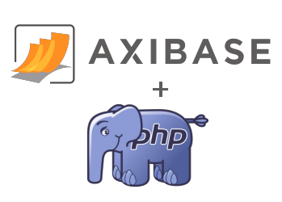

# ATSD PHP Client



## Table of Contents

* [Overview](#overview)
* [Request Methods](#request-methods)
* [Installing PHP Client](#installing-atsd-php-client)
* [Examples](#examples)
* [Troubleshooting](#troubleshooting)

## Overview

**ATSD PHP Client** enables PHP developers to read statistics and metadata from [Axibase Time Series Database](https://axibase.com/docs/atsd/) as well as build reporting, analytics, and alerting solutions. Get started by downloading [Composer](https://packagist.org/packages/axibase/atsd-api-php) to install project dependencies. PHP Client supports various request methods, enumerated below, for interfacing with the database.

## Request Methods

### [REST API](https://axibase.com/docs/atsd/api/data/)

Accessing the REST API via PHP client allow you to retrieve data from the database using HTTP requests.

#### Series

* [Series: `query`](https://axibase.com/docs/atsd/api/data/series/query.html)<br>
  Retrieves time series objects for the specified metric, entity, tags, and date range. Applies common time series transformations including aggregation, interpolation, downsampling etc.

#### Properties

* [Properties: `query`](https://axibase.com/docs/atsd/api/data/properties/query.html)<br>
  Retrieves property records for the specified filters including type, entity, key, and time range.

#### Alerts

* [Alerts: `query`](https://axibase.com/docs/atsd/api/data/alerts/query.html)<br>
  Retrieves **open** alerts for specified filters.

* [Alerts: `history query`](https://axibase.com/docs/atsd/api/data/alerts/history-query.html)<br>
  Retrieves a list of **closed** alerts matching specified fields.

### [Meta API](https://axibase.com/docs/atsd/api/meta/)

The Meta API allows you to query metadata for metrics, entities, and entity groups in the database.

#### Metrics

* [Metric: `get`](https://axibase.com/docs/atsd/api/meta/metric/get.html)<br>
  Retrieves properties and tags for the specified metric.

#### Entities

* [Entity: `get`](https://axibase.com/docs/atsd/api/meta/entity/get.html)<br>
  Retrieves fields and tags describing the specified entity.

* [Entity: `metrics`](https://axibase.com/docs/atsd/api/meta/entity/metrics.html)<br>
  Retrieves a list of metrics collected by the entity.

#### Entity Groups

* [Entity Group: `get`](https://axibase.com/docs/atsd/api/meta/entity-group/get.html)<br>
  Retrieves information about the specified entity group including its name and user-defined tags.

* [Entity Group: `get entities`](https://axibase.com/docs/atsd/api/meta/entity-group/get-entities.html)<br>
  Retrieves a list of entities that are members of the specified entity group and are matching the specified filter conditions.

---

## Installing ATSD PHP Client

**Prerequisites**:

* [Install ATSD](https://axibase.com/docs/atsd/installation/).
* PHP `5.3.2+` and `php5-curl`.

### Linux

* Open command prompt, clone the `atsd-api-php` repository to the local file system and move it to `root` directory:

   ```sh
   git clone https://github.com/axibase/atsd-api-php.git
   mv atsd-api-php /root
   ```

* Download and install project dependencies via [`composer.json`](https://packagist.org/packages/axibase/atsd-api-php) file.

  Open Composer file:

  ```sh
  cd ./path/to/composer/
  xdg-open composer.json
  ````

  Append the following parameter `composer.json`:

  ```json
  {
  "require": {
      "axibase/atsd-api-php": "dev-master"
      }
  }
  ```

### Windows

* Follow the [Windows Installation Guide](./ATSD-php-client_Windows.md)

### Configure Credentials

Specify credentials in [`atsd.ini`](atsd-api-php/atsdPHP/atsd.ini):

```sh
url = <atsd-server>
username = <username>
password = <password>
```

### Check connection

Navigate to the following URL:

`localhost/atsd-api-php/examples/testConnection.php`.

The target application response is **Connection success.**

---

## Examples

* [`AtsdClientBasicExample`](./examples/BasicExample.html)
* [`AtsdClientAlertsExample`](./examples/AlertsExample.html)
* [`AtsdClientAlertsHistoryExample`](./examples/AlertsHistoryExample.html)
* [`AtsdClientEntitiesExample`](./examples/EntitiesExample.html)
* [`AtsdClientEntityGroupsExample`](./examples/EntityGroupsExample.html)
* [`AtsdClientMetricsExample`](./examples/MetricsExample.html)
* [`AtsdClientPropertiesExample`](./examples/PropertiesExample.html)
* [`AtsdClientSeriesExample`](./examples/SeriesExample.html)

### Metadata Query

```php
$client = new HttpClient();
$client->connect();

$expression = 'name like \'nurs*\'';
$tags = 'app, os';
$limit = 10;

$queryClient = new Entities($client);

$params = array("limit" => $limit, 'expression' => $expression, 'tags' => $tags );
$responseEntities = $queryClient->findAll($params);

$viewConfig = new ViewConfiguration('Entities for expression: ' . $expression . "; tags: " . $tags . "; limit: " . $limit, 'entities', array('lastInsertTime' => 'unixtimestamp'));
$entitiesTable = Utils::arrayAsHtmlTable($responseEntities, $viewConfig);

$entity = "awsswgvml001";
$responseEntity = $queryClient->find($entity);

$viewConfig = new ViewConfiguration('Entity: ' . $entity, "entity");
$entityTable = Utils::arrayAsHtmlTable(array($responseEntity), $viewConfig);

$params = array("limit" => $limit);
$responseMetrics = $queryClient->findMetrics($entity, $params);

$viewConfig = new ViewConfiguration('Metrics for entity: ' . $entity, "metrics");
$metricsTable = Utils::arrayAsHtmlTable($responseMetrics, $viewConfig);

Utils::render(array($entitiesTable, $entityTable, $metricsTable));


$client->close();
```

### Series Query
```php
$client = new HttpClient();
$client->connect();

$queryClient = new Series($client);
$queryClient->addDetailQuery('nurswgvml007', 'cpu_busy', 1424612226000, 1424612453000);

$aggregator = new Aggregator(array(AggregateType::AVG), array("count" => 1, "unit" => TimeUnit::HOUR));
$queryClient->addAggregateQuery('nurswgvml007', 'cpu_busy', 0, 1424612453000, $aggregator);
$queryClient->addQuery("nurswgvml007", "cpu_busy", array("limit" => "4"));
$response = $queryClient->execQueries();

$tables = array();
$tables[] = Utils::seriesAsHtml($response[0], "detail series");
$tables[] = Utils::seriesAsHtml($response[1], "aggregate series");
$tables[] = Utils::seriesAsHtml($response[2], "custom series");

Utils::render($tables);
$client->close();
```

### Custom Query

Series queries support [aggregation functions](https://axibase.com/docs/atsd/api/data/series/aggregate.html#aggregate-processor) such as [interpolation](https://axibase.com/docs/atsd/api/data/series/aggregate.html#interpolation):

```php
$queryClient->addQuery("Entity1", "Metric1", array(
    "startDate" => "2015-02-05T09:53:00Z",
    "endDate" => "2015-02-05T09:54:00Z",
    "timeFormat" => "iso",
    "requestId" => "r-1",
    "tags" => array(
        "tag1" => array(
            "value1"
        ),
        "tag2"=>array(
            "value2",
            "Value3"
        )
    ),
    "type"=>"history",
    "group"=>array(
        "type"=>"AVG",
        "interpolate"=>"STEP"
    ),
    "rate"=>array(
        "period"=>array(
            "count"=>1,
            "unit"=>"HOUR"
        )
    ),
    "aggregate"=>array(
        "types"=>array(
            "AVG",
            "MAX"
        ),
        "period"=>array(
            "count"=>1,
            "unit"=>"HOUR"
        ),
        "interpolate"=>"NONE"
    )
));
```

### Troubleshooting

```txt
Fatal error: Uncaught exception 'Exception' with message 'DateTime::__construct():
It is not safe to rely on the system's timezone settings. You are required to use the date.timezone setting or the date_default_timezone_set() function.
In case you used any of those methods and you are still getting this warning, you most likely misspelled the timezone identifier.
We selected the timezone 'UTC' for now, but please set date.timezone to select your timezone.'
```

Upon reception of the above error message, ensure that `variable date.timezone` in `php.ini` is correctly configured.